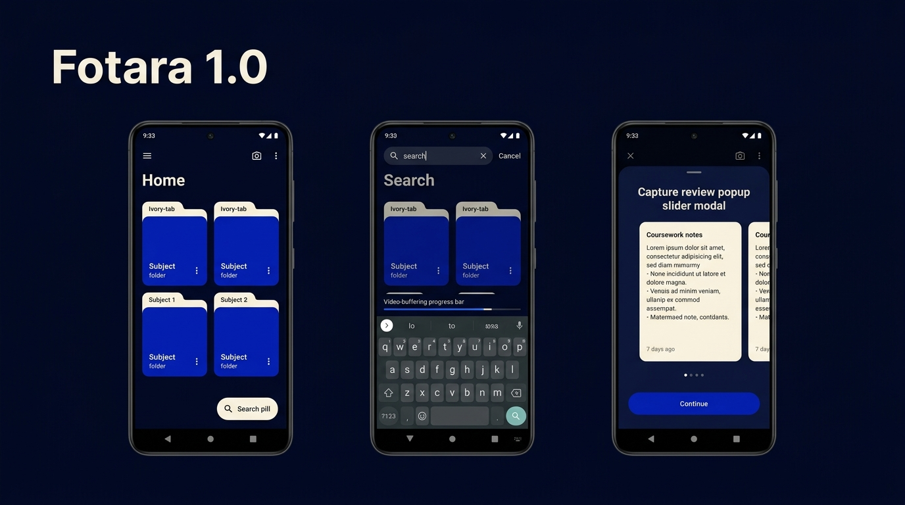

# Fotara 1.0 - Core Experience & UX Revision 2
Released: 2026-09-23   Status: Beta

## What's New
- Active keyboard-docked search bar with fluid spring animation and indeterminate video-buffering progress bar.
- Inline long-press folder and subfolder text renaming with haptic feedback pulse.
- Subject folder screen top navigation bar featuring dedicated Add Photo button (+) and highlighted circular overflow menu (⋮).
- Capture triage Popup Slider Modal (75% height, 90% width) with horizontal snap-to-center paging and individual discard/crop controls.
- Full-Screen Note Inspector for studying existing photos with deep multi-touch zoom and expandable OCR text reader.
- Multi-capture camera flow for continuous note photography with auto-perspective alignment guides.
- On-device offline OCR engine indexing handwritten diagrams, equations, and coursework text for instant search.
- Smart folder auto-suggestion matching recognized OCR keywords to coursework subject folders.
- Photo contextual quick-action sheet on long-press (move to subfolder, update tag color, attach assignment deadlines).

## Fixed
- Bug A: Floating search dock now enforces strict 16dp elevation and dynamic system navigation bar insets, preventing obstruction by Android gesture navigation.
- Bug B: Search bar tap target completely decoupled from folder creation dialog; search bar activates search mode only.

## Patches
### 1.0.1 - 2026-09-23
- Multi-Capture Camera: Replaced placeholder capture with live CameraX viewfinder session, non-blocking consecutive multi-capture, and camera permission fallback.
- Photo Import: Integrated real Android photo picker (`PickMultipleVisualMedia`) copying full-res media and generating downscaled thumbnails.
- ML Kit On-Device OCR: Integrated Google ML Kit offline text recognition directly indexing slide and whiteboard photos.
- Offline SQLite Storage: Implemented SQLite database persistence with universal Android FTS4 full-text search virtual indexing.
- Multi-Select & Bulk Delete: Added home screen folder multi-selection mode with custom card-level long-press menu ("Select" / "Pin to Top"), contextual action bar (`[✕] [N Selected] [Select All] [🗑️]`), and safety confirmation dialog detailing total folders, photos, and exact megabytes freed.
- Offline PDF Export: Implemented multi-page A4 document generation (`PdfExporter`) directly shareable via Android system share sheet.
- Assignment Deadline Alarms: Implemented Android `AlarmManager` and notification channel reminders.
- Startup Crash Fix: Resolved launch crash (white screen followed by exit) caused by unsupported SQLite FTS5 module on Android devices by migrating to universal FTS4, adding automatic corrupt database recovery, installing a local crash logger (`crash.log`), and styling theme window background to dark.
