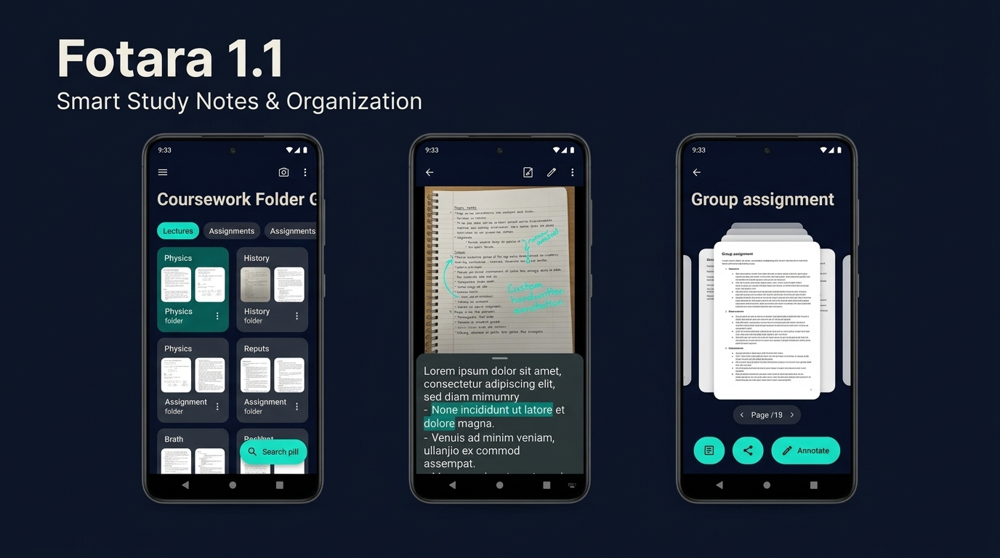

# Fotara 1.1 - Custom Study Notes & Enhanced Search
Released:    Status: In Development

## What's New
- Individual Photo Custom Notes: Attach personal study notes and formula explanations directly to individual photo note images with full-text search indexing.
- Note Editor in Full-Screen Inspector: Dedicated interactive note editing sheet in the full-screen photo viewer with instant persistence.
- Photo Renaming: Quick-action menu now includes a "Rename Note" action with dedicated dialog and immediate FTS index updates.
- Fast Non-Blocking Startup: Migrated repository and database initialization to background IO coroutines, eliminating main-thread disk I/O and latency on app launch.
- Subfolder Management: Unified single long-press context menu on subfolder tabs providing Rename, Delete with Trash confirmation, and Select.
- Subfolder Multi-Select: Multi-select tab row mode with filled checkmark indicators and bulk move to Trash.
- In-Folder Photo Multi-Select: Contextual action bar replacing folder top bar with bulk Delete to Trash, single-item Rename, Move to Folder, and Color Label actions.
- Direct Search Navigation & Highlight: Tapping a search result navigates directly to the source folder, selects the target subfolder tab, auto-scrolls to the matching note, and displays a temporary 3-second non-blocking translucent highlight.
- Data Safety Trash & Recycle Bin: Dedicated Trash screen with 30-day retention countdown, individual and bulk permanent deletion, orphan parent restoration prompts, and startup auto-purge.
- Grouped Settings Dashboard: Comprehensive settings screen featuring Display & Organization preferences, on-device OCR scripts and downsampling quality, notification lead times, storage usage breakdown with thumbnail rebuilding, full offline JSON backup export and import, search index rebuild, and Trash quick entry.
- Guided First-Run Onboarding: Transparent pre-permission explanation for local camera and storage access, paired with an optional starter subject folder setup (Math, Science, History, Literature) or clean start.
- Photo Viewer 90° Rotation & Re-crop: Full-screen note viewer now features a 90° clockwise manual rotation control and an interactive 4-corner crop tool that directly updates the stored note bitmap and re-indexes on-device OCR text without creating duplicate image files.
- Search Filters & Recent Searches: Filter search results by Date Range (Today, This Week, This Month) and Color Labels via a horizontal scrolling chip row docked directly above the keyboard-docked search bar, paired with persistent recent search history and one-tap query clearing.
- "Due Tomorrow" Home-Screen Widget & Actionable Notifications: Stay ahead of coursework deadlines with an Android home-screen widget displaying upcoming due notes (featuring an empty state card when caught up) and system notifications equipped with a direct [View Note] action button that deep-links straight into the full-screen note viewer.
- Responsive Tablet & Landscape Layout: Automatic adaptive grid density dynamically expands folders (2 to 5 columns) and photo notes (3 to 6 columns) across tablets and landscape orientations with full support for accessibility font scaling up to 200%.
- Folder Privacy Lock: Protect sensitive coursework and personal study notes behind a 4-digit PIN or device biometrics (fingerprint/face recognition). Locked folders present a secure card preview with thumbnails hidden, and include an offline device credential fallback for seamless PIN recovery without cloud accounts.
- Photo Groups: Bundle two or more related study notes into a single named grid card with cover thumbnail, note count badge, and color label. Tapping opens a scoped review slider with individual rotate, crop, share, and removal (with 1-note auto-dissolve). Includes a group long-press context menu (Rename, Ungroup, Delete to Trash, Color label, Add photos), mixed-selection support in folder multi-select mode, offline search indexing with auto-scroll highlight, and sequential PDF export with group section separator pages.
- Cross-Folder Smart Tags: Label and aggregate coursework concepts across multiple subject folders through automatic `#hashtag` extraction from captions and notes, alongside explicit tags. Includes instant one-tap tag filter chips docked in the search bar and interactive tag management in the full-screen note inspector.
- Zoom-Gated Swipe Navigation: Horizontal swiping across photo collections in all slider and inspector views (group inspection, triage review, and full-screen study) advances between photos exclusively at standard fit-to-screen scale (1.0x). When zoomed in, horizontal dragging smoothly pans the enlarged photo without accidental page advances, with immediate reset via double-tap or pinch-out.

## Patches
### 1.1.1 - 2026-09-24
- Grid Column Setting Wired & Live: Folder and note thumbnail grids now actively respect the stored grid density setting (2, 3, or 4 columns) with live updates upon setting changes, combined additively with responsive tablet and landscape display scaling.
- Subfolder Rename, Delete & Bulk-Delete Restored: Resolved pointer event consumption on subfolder tabs; long-press now opens the context menu for Rename, Delete (with trash item count confirmation), and multi-selection mode with bulk deletion.
- Smooth Single-Finger Photo Swiping: Corrected gesture consumption in the full-screen photo viewer so 1-finger horizontal swipes reliably advance to adjacent photos at 1.0x scale, while retaining zoom and panning when enlarged.
- Dedicated Fullscreen Group Screen: Tapping a group card now navigates directly to a dedicated grid screen displaying all member photos with order-added sorting, [+] Add photos button, and an overflow menu (Rename, Ungroup, Delete to Trash, Color label). Tapping a member photo opens the scoped photo slider with single-member auto-dissolve support upon note removal.
- Chained Search Highlight for Grouped Member Notes: Finding OCR text or notes belonging to a grouped photo first highlights the group card waypoint in the folder grid before automatically transitioning into the group screen to spotlight the specific matched photo.

