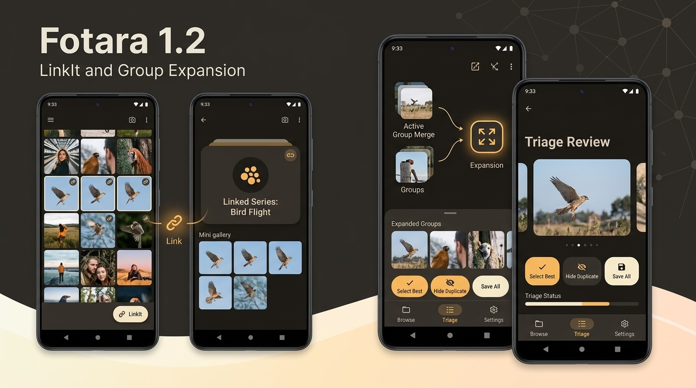

# Fotara 1.2 - Group Expansion & LinkIt
Released: 2026-09-25   Status: Beta

## What's New
- Merge Photo Groups: Select multiple photo groups in folder multi-select mode to merge their member notes into a single unified group with a custom name.
- Move Group to Subfolder: Relocate an entire photo group and all of its member notes together to any folder or subfolder.
- Add Notes to Existing Group: Select standalone notes and instantly add them to any existing group app-wide with automatic subfolder alignment.
- Capture & Import Directly into Groups: Add notes directly to a group via camera capture or photo gallery import with triage review.
- Manual Group Cover Photo: Custom "Set as cover" action on member notes in the group screen to choose the cover image.
- Independent Photo Duplication: "Copy to..." quick action creates a fully independent duplicate note with its own file and OCR text.
- Action Undo Snackbar: 4-second instant undo for deletions, moves, and ungroup actions.
- Recent Destinations in Pickers: Fast access to recently chosen folders, subfolders, and groups at the top of move and copy pickers.
- Group-Level Deadlines: Assign deadlines and reminder alarms directly to photo groups.
- Group & Mixed PDF / ZIP Export: Export single groups or mixed selections of groups and notes to formatted PDFs or ZIP archives containing original images.
- LinkIt Spatial Grouping: Link 2 to 4 folders on the home screen or notes/groups in folders so they always appear consecutively in grid order regardless of sort mode.
- In-Review Photo Renaming: Rename notes directly in the capture review slider before saving.

## Changed
- Trash Severance: Trashing a photo immediately detaches it from its group, auto-dissolving the group if only one note remains.
- Due Tomorrow Widget Disabled: Home-screen widget disabled for this version while preserving underlying components.

## Fixed
- Theme Setting Correction: Removed the non-functional "Light" theme option from Settings, offering System Default and Dark Mode with automatic migration.
