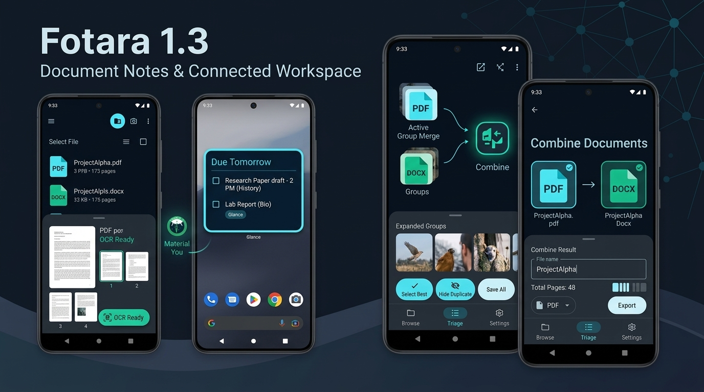

# Fotara 1.3 - Document Notes & Connected Workspace
Released: 2026-09-25   Status: Beta

## What's New
- PDF Document Notes: Import PDF files with native page rendering, on-device OCR, continuous vertical scroll viewer, and irreversible Split to Images.
- DOCX Document Notes: Import Word documents with direct XML text extraction and seamless hand-off to external document apps.
- Modernized Glance Widget: Redesigned "Due tomorrow" widget using Jetpack Glance with responsive reflow, interactive actions, and direct note deep-linking.
- Batch Renaming: Rename single items or batch-rename multiple selected notes, groups, or document notes with sequential automatic numbering.
- Home Folder Rename Parity: Multi-select rename action for subject folders on the home screen.
- Group Screen Interaction Parity: Full multi-select, delete, batch rename, and Share As inside fullscreen group views.
- Unified Share As Picker: Share any single or mixed selection as Original files, combined PDF, or compiled Word (.docx) document.
- Heavy Combine UX: Determinate progress indicator and clean cancellation for PDF and Word combine operations.
- Dynamic In-App Updates: Check GitHub releases with tri-state status, fullscreen release notes, background progress notifications, and sideload guidance.
- Suggestions & Bug Reports: In-app feedback form submitting to Supabase with anonymous install rate limiting and optional diagnostics.
- QRIS Support Screen: Quick access to QRIS donation image with instant save/download.
- What's New Changelog: Automatic post-update release notes overview and permanent access in Settings.

## Changed
- Pre-Flight 100-Page Limit: Export and combine operations exceeding 100 total pages are blocked before processing to guarantee device stability.
- Core Offline Discipline: All organizing, text recognition, search, and storage remain fully offline-first while update and suggestion services connect on-demand.
