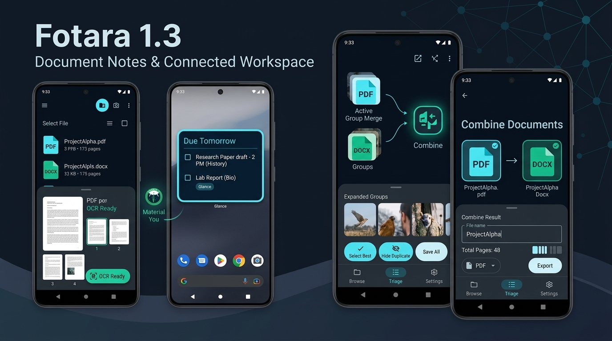

# Fotara 1.3 - Document Notes & Connected Workspace
Released: 2026-09-25   Status: Beta

## What's New
- PDF Document Notes: Import PDF files with native page rendering, on-device OCR, continuous vertical scroll viewer, and irreversible Split to Images.
- DOCX Document Notes: Import Word documents with direct XML text extraction and seamless hand-off to external document apps.
- Modernized Glance Widget: Redesigned "Due tomorrow" widget using Jetpack Glance with responsive reflow, interactive actions, and direct note deep-linking.
- Batch Renaming: Rename single items or batch-rename multiple selected notes, groups, or document notes with sequential automatic numbering.
- Home Folder Rename Parity: Multi-select rename action for subject folders on the home screen.
- Group Screen Interaction Parity: Full multi-select, delete, batch rename, and Share As inside fullscreen group views.
- Unified Share As Picker: Share any single or mixed selection as Original files, combined PDF, or compiled Word (.docx) document.
- Heavy Combine UX: Determinate progress indicator and clean cancellation for PDF and Word combine operations.
- Dynamic In-App Updates: Check GitHub releases with tri-state status, fullscreen release notes, background progress notifications, and sideload guidance.
- Suggestions & Bug Reports: In-app feedback form submitting to Supabase with anonymous install rate limiting and optional diagnostics.
- QRIS Support Screen: Quick access to QRIS donation image with instant save/download.
- What's New Changelog: Automatic post-update release notes overview and permanent access in Settings.

## Changed
- Pre-Flight 100-Page Limit: Export and combine operations exceeding 100 total pages are blocked before processing to guarantee device stability.
- Core Offline Discipline: All organizing, text recognition, search, and storage remain fully offline-first while update and suggestion services connect on-demand.

## Patches
### 1.3.5 - 2026-09-26
- Complete In-App Feedback & Bug Reporting Suite: Integrated interactive 4-category selector (Bug Report, Suggestion, Feature Idea, General) with automatic opportunistic offline queue synchronization.
- Hardened Supabase Data Layer: Configured fixed-length HTTP streaming payloads, compliant user-agent and accept headers, and expanded daily submission allowance to 30 reports with a smooth 3-second throttle.
- Real-Time Developer Email Dispatch: Implemented automated Google Apps Script and database webhook bridge relaying incoming feedback and diagnostics directly to `arinaranetwork@gmail.com` in styled, responsive HTML.
- Transparent Error Feedback: Exposed granular network response diagnostics, preventing false-positive success toasts when network or database requests encounter failures.
- Universal Rich Markdown Rendering: Verified multi-format styling (bold, italic, inline code, blockquotes, and lists) across What's New, Update notes, and personal study notes.

### 1.3.4 - 2026-09-26
- Persistent Background Installer: Decoupled update download execution from the Compose UI lifecycle into an application-scoped background coroutine, preventing progress resets and file deletion when navigating away or switching apps.
- Notification Bar Deep Linking: Added ongoing download progress notification and completion alert with direct deep linking into the installer prompt.
- Explicit Download Cancellation: Added an in-app "Batalkan Unduhan" action to cleanly abort downloads and purge temporary `.part` files.
- Automated Supabase Email Dispatch: Built an automated Google Apps Script and database webhook bridge forwarding user feedback, suggestions, and bug reports directly to `arinaranetwork@gmail.com` formatted in a clean, categorized HTML template.

### 1.3.3 - 2026-09-25
- Global Rich Markdown Renderer: Deployed universal inline and block markdown formatting across What's New, App Update release notes, and personal study notes, rendering `**bold**`, `*italic*`, `***bold italic***`, `` `code` ``, `~~strikethrough~~`, and `> blockquotes`.
- Update Fast-Forward & Re-Check: Enabled on-demand re-checking from the App Update screen to scan all available releases and immediately skip to the newest available build.
- OTA In-App Verification Build: Published version 1.3.3 to validate in-app package installer initiation, download resumption, and permissions on physical devices.
- Extended viewport clearance verified across all navigation and action screens.

### 1.3.2 - 2026-09-25
- Declared `REQUEST_INSTALL_PACKAGES` permission in `AndroidManifest.xml` and added runtime unknown app source verification with direct Settings handoff to fix installer initiation.
- Mapped external files and cache directories in `file_paths.xml` for seamless FileProvider read compatibility with system PackageInstaller.
- Extended App Update screen scroll length and applied `navigationBarsPadding` to prevent bottom action buttons from being covered by the system navigation bar.
- Elevated contextual multi-select bottom dock safely above system 3-button navigation bar via `navigationBarsPadding`.
- Protected navigation backstack from double-click pop exhaustion, preventing accidental app stops on rapid close/back.
- Redesigned What's New with rich categorized section cards, custom badges, and styled bullet points.
- Renamed Software Update to App Update with status bar insets for natural screen positioning.
- Established complete Supabase database schema with RLS protection and 10/hour database rate limit trigger.
- Enhanced offline-first local submission queue in FeedbackManager with automatic background synchronization.

### 1.3.1 - 2026-09-25
- Fixed LinkIt feature visibility and layout with dedicated badges across folders and note cards.
- Restructured folder multi-select with a dedicated contextual action dock preventing action clipping.
- Integrated intelligent folder/subfolder suggestion chips into the camera review workflow.
- Implemented functional 90-degree image rotation in the capture review perspective tool.
- Wired camera button on the Home screen floating dock.
- Modernized in-app update engine with automatic launch check and resilient GitHub release asset redirect handling.
- Dynamically bound Settings screen version display to active application package metadata.
