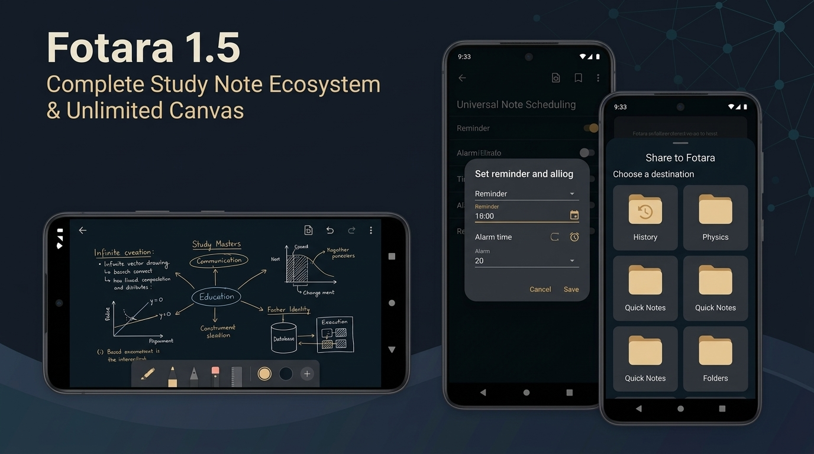

# Fotara 1.5 - Complete Study Note Ecosystem & Unlimited Canvas
Released: 2026-09-30   Status: Beta

## What's New
- Unlimited Drawing Canvas (Alpha): Introducing an infinite 2D vector drawing canvas note type with freeform pan, pinch-to-zoom, pressure-sensitive pen, highlighter, eraser, multi-layer management, image attachments, and high-resolution PNG export.
- Universal Note Scheduling: Attach custom date and time reminder schedules to any note type (Photos, Groups, PDFs, Word DOCX, Text Notes, and Canvas) with user choice between standard notifications and ringing alarm alerts.
- Dedicated "Today" Home Widget: A new rectangular Jetpack Glance widget displaying assignments due today, newly captured study notes, and upcoming scheduled alerts with instant deep-linking.
- Share to Fotara: Seamlessly share images, PDFs, Word documents, Markdown, and plain text directly from other Android apps into Fotara with an intuitive multi-item destination placement screen.
- Search Date Filtering: Filter notes instantly by date added with quick chips (Today, Yesterday, This week, This month, This year) and custom single-day or date-range pickers.
- Rich Text Formatting Toolbar: Upgraded native text editor toolbar with full support for bold, italic, bold-italic, strikethrough, headings, inline code, link creation, dividers, and interactive checklists.
- In-Viewer PDF Zoom: Smooth pinch-to-zoom and two-axis panning directly on PDF pages inside the native viewer with sharp on-demand viewport rasterization.

## Changed
- Global English Standardization: Standardized all application text, dialogs, error messages, settings, notifications, widgets, and release notes exclusively in English.
- Redesigned LinkIt Corner Glow: Replaced the loud amber pill badge with a subtle, elegant radial corner glow that remains crisp and uniform from Android 7.0 (API 24) to Android 16 (API 36).
- Intelligent PDF Split to Images: PDF splitting now generates high-fidelity white-canvas images without dark artifacts, automatically grouping documents with 5 or more pages into a Photo Group while preserving page order.
- Tightened Feedback Limits: Enforced a 5-submission rolling 24-hour quota and a 60-second cooldown timer on feedback and bug reports to ensure reliable service delivery.

## Fixed
- Fixed intermittent UI freezing and frame stutter when scrolling through 30+ page PDF documents.
- Fixed HTTP 400 Bad Request errors when submitting feedback and bug reports to the Supabase backend.
- Fixed non-functional bold, italic, strikethrough, heading, and quote buttons in the native text note editor.
- Fixed transparent page rasterization artifacts in PDF rendering and Split to Images export.
- Removed legacy "Sharp PDF Note" label across all screen subtitles and headers.

## Patches
### 1.5.1 - 2026-10-01
- Photo-Style PDF Page Viewer: New Page View button in the PDF header opens a dedicated fullscreen page viewer with pinch-to-zoom up to 4.0x, free two-axis pan, double-tap zoom, zoom-gated horizontal swipe, and a collapsible Recognized OCR Text bottom sheet with instant copy.
- Viewport-Level List Zoom: Rebuilt PDF list viewer zoom to transform the entire document viewport with natural two-axis pan, double-tap to zoom or reset, and live amber status indicator.
- Resolved slim and distorted PDF page rendering at 1.0x by eliminating the default aspect ratio race condition and computing exact target dimensions with unified layout math.
- Fixed boxed in-card zoom constraints so zooming in the PDF list no longer feels boxed into a single page.
- Fixed high-density bitmap allocation during pinch gestures with memory-bounded caching and automatic resource reclamation.

### 1.5.2 - 2026-10-02
- Canvas Debounced Autosave: Automated 500ms background saves with single-writer mutex queue, atomic writes, synchronous flush on backgrounding, and an interactive save status pill (Saving, Saved, Retry).
- Precision 1:1 Canvas Pan & Zoom: 1:1 finger tracking across any zoom level without lag or jumpiness, coordinate clamping to 20,000 x 20,000 extents, and viewport-culled rendering without duplicate stroke passes.
- Safe Image Attachment: Streamlined ContentResolver imports via single-pass staging, automatic downsampling (<= 2048px), EXIF orientation correction, and insertion as a new dedicated layer centered in the active viewport with undo/redo support.
- Insert From Existing Notes: In-canvas visual image picker allowing insertion of snapshots directly from existing photo and scan notes into new canvas layers.
- Layer-Aware Stroke Eraser: The broom tool now erases vector strokes strictly within the currently active canvas layer without affecting other layers.
- Searchable OCR & DOCX Content: Added SQLite FTS4 virtual table indexing for Word DOCX and PDF documents with multi-word prefix search, relevance ranking (titles before content), and context-centered `[OCR]` / `[DOCX]` result snippets.
- Responsive Canvas Navigation: Single-line adaptive top bar eliminating collisions on compact screens or large fonts, with the floating zoom pill smoothly adjusting above the dock.
- Dynamic Facing Folder Glow: Glowing folder cards on the home screen dynamically face adjacent glowing neighbors along cardinal edges and diagonal corners.
- Drawing Mode Guardrails: Centralized canvas safety limits preventing out-of-bounds panning, memory overruns, and layer explosion (up to 50 layers).
- Text Note Editor Toolbar & Caret Precision: Completely overhauled editor toolbar with pure transformation operations, eliminating caret placement inversion after prefixes, adding automatic list continuation and blank-line exit on Enter, single-stroke backspace prefix deletion, live preview styling with 1:1 active line caret stability, and interactive checkbox toggling.
- Canvas Note Contextual Actions: Long-pressing a drawing note now opens a full quick-action panel offering Rename, Color Label, Deadline, Schedule Reminder, Move to Folder, Share/Export as PNG, Batch Selection, and Delete to Trash.
- Elms Sans Typography Migration: Migrated the entire application typography to Elms Sans with strictly three weights (Light 300, Medium 500, Bold 700) mapped by context, and completely removed italics across all UI titles, folder cards, search bars, and dialogs.
- Folder Screen Header Spacing: Resolved visual and touch target collision between the folder header Add (+) and Kebab (⋮) buttons, establishing clean 10dp separation and dedicated 48dp touch targets.
- Complete Home Screen Redesign: Modernized home dashboard with near-black background (`#0A0D14`), 1:1 dark folder cards (`#111726`, 24dp radius), muted accent icon tiles, facing LinkIt corner stroke glows, segmented tab bar (All, Favorit, Arsip), non-overlapping bottom search dock with '+' action popup, and a floating bottom navigation bar (Home, Notes, Settings).

### 1.5.3 - 2026-10-03
- Section-Oriented Settings Screen: Reorganized settings into 6 main section rounded cards on root (General, Appearance, OCR & Recognition, Notifications & Deadlines, Storage & Data Management, About & Legal) with clean, un-carded detail lists inside each opened category.
- Full-Height Home Viewport & Navigation Clearance: Eliminated artificial vertical constraints on the home dashboard, allowing folder grid content to scroll smoothly using the full screen height while staying completely unobstructed by system navigation buttons.
- Photo Viewer Responsive Header: Reorganized inspector toolbar into a clean title and action row paired with a full-width horizontal status row, ensuring helper text and schedule badges never wrap vertically on narrow phone widths.
- Search Result Auto-Scroll & Exposure Highlight: Tapping any search result (Photos, Groups, PDF documents, Word DOCX, Text Notes, Canvas) navigates directly to the parent folder and active subfolder, auto-scrolls until the item is visible, and applies a subtle 2-second brightness/exposure flash before fading out cleanly.

### 1.5.4 - 2026-10-03
- Direct Hardware-Accelerated Canvas Rendering: Switched canvas rendering to direct hardware-accelerated vector and image drawing, completely eliminating missing tile cutouts and dark grid boxes during pinch-to-zoom and stroke drawing.
- Black Box & Dot Stippling Fix: Fixed solid black rectangular boxes appearing when drawing dots or rapid strokes by removing RGB_565 degradation and rendering single-point strokes with solid fill.
- Multi-Zoom Vector Fidelity: Vector strokes and imported whiteboard/scan images now maintain crisp sub-pixel precision across extreme zoom ranges (up to 500%) with zero tile seams or blurriness.
- Unified Activity Notes Screen: Full-featured activity timeline under the "Notes" bottom navigation tab with date grouping (Today, Yesterday, calendar dates), colored status dots, pill-shaped uppercase date headers with item counts, multi-type rounded cards, interactive note-type filter chips (All, Photos, Documents, Text, Canvas), real-time search, contextual 3-dot overflow actions (Open, Rename, Move, Delete to Trash), and quick '+' note creation floating action button.
- In-App "New Update" Modal Dialog: Modern rounded modal popup over a dimmed background announcing new available versions on startup with an edge-to-edge landscape illustration banner, bold overlaid version title, scrollable release notes, and tonal "Later" (session-only dismissal) and "Skip this version" (persistent semantic version bypass) actions.

### 1.5.5 - 2026-10-03
- Reading Mode Zoom Gating: In the PDF viewer, pinch-to-zoom, double-tap zoom, and panning are now strictly gated by the top-bar Reading Mode toggle (book icon). Outside reading mode, zoom gestures are fully detached at the gesture level so vertical page scrolling remains completely fluid and double-taps do nothing.
- Smooth Hardware-Accelerated 1:1 Zoom: Rebuilt zoom handling across the PDF viewer and photo viewer to track pinch focal points 1:1 directly in the GPU compositing layer (`graphicsLayer`), eliminating gesture restarts and frame-dropping recompositions. High-resolution PDF rendering is debounced until gestures settle, preventing blank flashes and memory spikes.
- Streamlined Viewer Headers & Three-Dot Info Menu: Cleaned up top toolbars in both the photo viewer and PDF viewer to single-line centered titles without subtitle clutter. Shifted gesture guidance and offline indicators into an informative, non-clickable "Info" header inside the three-dot overflow menu.
- Text Note Editor Reliability & Notion-Lite Rework: Completely rebuilt the native text note editing engine with atomic prefix handling and reliable caret positioning. Typed text can never enter block brackets or delimiters, and tapping any checkbox in edit mode toggles it instantly and smoothly without dismissing the keyboard.
- Predictable Keyboard Mechanics: Pressing Enter on an active bullet, numbered list, checkbox, or quote automatically creates the next item with matching indentation; pressing Enter on an empty item cleanly exits the list into a normal paragraph. Typing shortcuts (`- `, `* `, `1. `, `[] `, `# `, `## `, `### `, `> `) convert lines automatically, while Space never deletes or damages list prefixes.
- Automatic Numbered List Sequence: Numbered list items automatically renumber contiguous runs after insertion, deletion, or mid-list splitting, restarting numbering after paragraph breaks.
- In-Editor Live Formatting: Block prefixes render cleanly with native symbols (bullets `•`, numbered digits `1.`, checkboxes `☐`/`☑`, quote bars `▎`, horizontal rules `───`) while inline formatting delimiters (`**`, `*`, `~~`, `` ` ``, `[text](url)`) remain hidden until the caret moves directly into that span. Checked items display with an elegant dimmed strikethrough.
- Overflow-Free Editor Toolbar & Header: The formatting toolbar now scrolls smoothly with full button reachability and active highlight states. The top bar features a single-line title centered with icons, with word and character statistics neatly relocated to an "Info" section inside the three-dot overflow menu.
- High-Zoom PDF Sharpness: When reading-mode zoom extends beyond 2.0x up to 4.0x, visible PDF pages are re-rendered at high resolution matching the zoom level with memory-safe pixel budgeting (max 4.0M px) and double-buffering, eliminating blurriness without out-of-memory risks.
- Direct PDF Opening & Deep-Search Page Jumping: Tapping a PDF item in the Notes tab opens the PDF viewer directly at Page 1. Tapping a PDF search result opens the viewer directly at the first page matching search terms (prioritizing pages with all search terms, then any term) with seamless back-press exit hierarchy.
- Comprehensive Multi-Note Share & Export: Combining notes into PDF or Word (.docx) now includes Text Notes (rendered with rich markdown formatting: headings, bullets, numbered lists, checkboxes, blockquotes, code blocks, links) and Canvas Notes (rendered at full resolution; empty canvases are safely skipped), preserving user selection order.
- Safe Atomic Image Rotation & Cropping: Rotating or cropping photos now performs atomic file replacement via temporary files, preventing image corruption or data loss on interrupted writes, and consistently triggers OCR re-processing with FTS4 search index updates.
- Uniform Viewer "Info" Header: Standardized the three-dot overflow menu header across both the photo viewer and PDF viewer to a muted "Info" label.
- Smooth Vector Stroke Curves: Replaced angular low-poly canvas strokes with continuous quadratic Bezier curve interpolation through segment midpoints, applied zoom-aware decimation tolerance to preserve handwriting details at high zoom, and rounded highlighter stroke caps and joins.
- Instant Layer Creation & Inline Rename: Tapping "Add Layer" immediately creates the next available layer ("Layer N") without an interrupting dialog; long-pressing any layer name enables inline editing with automatic keyboard focus.
- Immediate New Folder Keyboard Focus: Opening the New Folder dialog automatically focuses the name field and brings up the soft keyboard for zero-tap typing.
- Direct Home (+) Folder Creation: Simplified the home screen floating (+) action button to open the New Folder dialog directly, eliminating redundant menu steps.

### 1.5.6 - 2026-10-04
#### Batch 1 - Selection and Eraser
- Non-Destructive Free-Form Lasso Selection: Select only the enclosed portions of drawing strokes with non-zero winding geometry (supporting self-crossing loops) without fragmenting unselected portions until mutations commit.
- Selection Action Bar & Partial Delete: Immediate contextual bar appearing right after selection with Duplicate, Move to Layer, and Delete (red), cleanly removing selected portions in a single undo step while leaving outside stroke remainders intact.
- Comprehensive Transform Handles: Move by dragging anywhere inside the selection box, free corner stretch with opposite corner fixed, single-axis side stretch, and box-center rotation with oriented bounding box and accessible 44dp hit targets.
- Dedicated Free Eraser: Replaced the broom icon with a real angled eraser tool, removing stroke-eraser mode, adding capsule sweep to prevent gaps during fast drags, eliminating remnant dots, and bundling entire drag operations into a single atomic undo step.

#### Batch 2 - Canvas Highlighter, Blending & UI Refinements
- Consistent Translucent Highlighter: Unified 35% base translucency across live drawing, committed strokes, tile caching, and image exports, rendering as a single continuous path without self-overlap darkening.
- Layer-Isolated Blend Modes: Added Normal, Multiply, Darken, and Screen blend modes to highlighter strokes, blending with content strictly within the same layer without affecting other layers or background grids.
- Dedicated Chisel Highlighter Icon: Custom angled marker icon with chisel tip replacing the previous palette icon in the canvas tool dock.
- Long-Press Tool Panels: Long-press Pen or Highlighter dock icons to quickly open stroke size and color palettes with haptic feedback, featuring an interactive Blending mode selector for the highlighter.
- Compact Bottom Tool Dock: Reduced bottom dock height by 20% for increased canvas drawing area, with dynamically anchored tool popups and zoom controls.
- Home & Notes Screen Scroll Polishing: Resolved cut-off cards under the bottom search dock and bottom navigation with runtime-computed bottom content padding, paired with smooth 20dp edge fading under top segmented tabs.

#### Batch 3 - Pull to Refresh, Grouped Add-to-Group & Export Presets
- Animated Pull-to-Refresh: Smooth curved-arrow vector indicator across Home folder grid, Notes timeline, and Folder note grids. Pull distance directly drives rotation, scale, and alpha inside hardware compositing layers with zero per-frame recomposition overhead, featuring a 700ms minimum display floor and 10s timeout safety.
- Folder-Organized "Add to Group" Dialog: Organized groups by parent folder with current folder groups prioritized at the top and other folders arranged in Home order. Moving photos into a group belonging to another folder atomically synchronizes folder and subfolder IDs while fully preserving note creation timestamps.
- Custom Combined Export File Names: Added optional file name input field to the "Share As" dialog for Combined PDF and Word documents with live preset placeholder, automatic illegal character stripping, length truncation (max 80 chars), and collision avoidance with unique numeric suffixes.
- Combined File Name Preset Setting: Added a dedicated "Combined file name" setting under General settings, supporting dynamic tokens ({folder}, {date}, {time}, {count}), one-tap chip insertion at the cursor position, real-time preview, inline syntax validation, and instant reset to default.
- Release Finalization: Validated full test suite (439 passing unit tests) and verified production APK build Fotara_1.5.6_Beta.apk (versionName "1.5.6 Beta", versionCode 20).

### 1.5.7 - 2026-10-04
#### Batch 1 - Canvas Stacking, Image Transforms & Overlay Layout
- Unified Canvas Element Stacking: Enforced strict layer-order-first element stacking. Within each layer, creation order decides rendering sequence with strokes and images treated identically. Strokes drawn after inserting an image render naturally on top, and documents reload deterministically.
- Viewport-Proportional Image Placement & Auto-Select: Inserting an image automatically scales it to 60% of the visible viewport, centers it on canvas, and switches to the Select tool with bounding handles active in a single undo step.
- Image-Only Transform Precision: Dragging corner handles on image-only selections scales proportionally with locked aspect ratio anchored to the opposite corner. Side-midpoint handles stretch along a single axis, and rotation handles follow image orientation.
- Constrained Canvas Tool Option Panels: Highlighter, Pen, and Eraser options panels now wrap their content within the available vertical space between top capsules and the bottom dock, scrolling smoothly when needed. Highlighter blending mode chips are fixed at 48dp in a single row with helper text fully visible.
- Floating Navigation Bar Spacing: Unified runtime height measurement for the floating bottom navigation bar ensures snackbar notifications and the Notes tab (+) floating action button remain fully visible above the bar and soft keyboard.
- Right-Aligned Overflow Menus: Fixed top-bar three-dot dropdown menus across Notes and other screens to open anchored directly beneath their trigger buttons, right-aligned and bounded within screen margins.

#### Batch 2 - Verification, Selection Inversion & UI Polish
- Invert Selection in Multi-Select Modes: Added dedicated Invert Selection action buttons to both Home folder multi-select and Folder item batch-select contextual top bars, instantly toggling selection state across all visible entities.
- Zero-Replay One-Shot Notifications: Rebuilt Settings feedback messaging on an event channel flow, guaranteeing action success notifications (such as Rebuild Search Index and Rebuild Thumbnails) display exactly once and never replay when navigating between tabs or rotating the device.
- Anchored Folder Card Dropdown: Restored the three-dot button on Home folder cards to trigger an anchored dropdown menu (with Pin to Top, Rename, Select, Lock/Unlock, Unlink, and Move to Trash), while cleanly preserving centered dialog interactions for long-press gestures.
- Facing Edge LinkIt Glow: Enhanced LinkIt partner glow calculation across all card types (PDF, DOCX, Photo, Group, Text Note, Canvas) in 2, 3, and 4 column grids to glow on cardinal facing edges (`RightEdge`/`LeftEdge` for same-row pairs and `BottomEdge`/`TopEdge` for vertical neighbors).
- PDF & DOCX Card Enhancements: Enabled real page 1 thumbnail previews for PDF cards, cleaned DOCX badges to display format without page counts, formatted DOCX card footers to date-only, and added localized singular/plural page count strings for PDFs.

#### Batch 3 - Settings & Search Redesign, Working Profile
- Redesigned Settings Dashboard: Edge-to-edge layout featuring a full-width header banner extending behind the status bar with a protective reading scrim and smooth vertical gradient fade into the dark surface. Centered profile block displays the user's avatar with decorative borders, an overlapping 32dp edit pen button, large bold name, and optional display-only email.
- Structured Settings Categories: Reordered settings into 7 rounded cards (Profile, General, Appearance, OCR & Recognition, Notifications & Deadlines, Storage & Data Management, About & Legal) with verified concise subtitles under 38 characters to ensure zero truncation across compact 360dp phone displays.
- Comprehensive Profile Management: Choose profile avatars and banners directly from device photos with a fullscreen aspect-ratio-constrained crop tool featuring 1x-5x pinch zoom and pan clamping. Live border picker renders selectable decorative borders (Neon Spark, Crystal Arc, Golden Wings, and None) directly over the active avatar. Includes auto-saving name and email fields with default "Fotara User" fallback.
- Atomic Profile File Storage: Local profile images are staged and atomically replaced in private application storage as high-quality WebP files (512x512 avatar, max 1080w banner) with automatic EXIF orientation correction and memory-safe downsampling.
- Redesigned Search Dashboard: Streamlined search interface with anchored 3-pill top controls (always-highlighted Sort with dropdown, Date range filter with calendar picker, and active Filter with active count badge), rounded search input with instant clear action, and an idle state featuring an offline indexing anime illustration with descriptive guidance.
- Interactive Recent Searches Card: Idle search view displays stored keyword history as compact chips with single-tap search execution and individual chip deletion, complemented by a quick "Clear Recents" button.
- Bottom Navigation Clearance: Content across both Settings and Search scrolls cleanly above the floating bottom navigation bar using dynamic runtime overlay measurement.

### 1.5.8 - 2026-10-04
- LinkIt Converging Cluster Glow: For linked groups of 3 or 4 cards arranged in a 2x2 grid cluster (including L-shaped triads), corner glows now converge toward the shared central intersection point with cardinal side glows suppressed within qualifying blocks. Pairwise cardinal edge glows are preserved for isolated pairs and line layouts across grid densities 2, 3, and 4.
- Profile Picture and Banner Instant Display Fix: Resolved an issue where profile pictures and banners failed to display after selection. Fixed top-bar action execution, verified WebP compress boolean checks with zero-byte corruption prevention, resolved StateFlow equality suppression via modification timestamps (avatarUpdatedAt, bannerUpdatedAt), and eliminated Coil image cache collisions.
- Dedicated Aspect-Locked Crop Editor: Replaced the crop step with a fullscreen interactive crop editor supporting 1:1 circular guide for profile pictures and exact layout-matched aspect ratio for banners. Features four accessible 44dp corner handles with opposite-corner-fixed resizing, two-finger pinch scaling around center, drag panning with boundary clamping, reset button, and high-fidelity region decoding directly from original image pixels via BitmapRegionDecoder without risk of out-of-memory errors on large photos.

### 1.5.9 - 2026-10-04
- Lossless PNG Profile Picture & Banner Support: Enforced true PNG format preservation with full 32-bit ARGB_8888 alpha transparency for custom avatars and banners, resolving encoder failures on transparent PNG images. Picker input streams are safely staged to private seekable cache storage.
- Expanded & Formatted In-App Update Modal: Upgraded update popup modal with an expanded vertical layout (up to 440dp height) and native Rich Markdown rendering, cleanly displaying headings (H1, H2, H3), bold text, bullet lists, blockquotes, and release note formatting.

### 1.5.10 - 2026-10-04
- Bulletproof Profile Picture & Banner PNG Crop: Resolved failures when cropping and saving PNG profile pictures and banners by migrating crop extraction directly into memory from the loaded preview bitmap using normalized coordinates. Eliminates native Skia region decoder failures, closed input streams, and boundary calculation errors across all Android versions.
- Safe Universal URI Stream Handling: Hardened image stream resolution to transparently support both `file://` and `content://` schemes across all Android API levels without `SecurityException` or stream reset issues.
- Clean Profile Sheet Navigation: Automatically dismisses the profile action bottom sheet upon selecting an action, ensuring the user immediately returns to the updated profile screen after saving.

### 1.5.11 - 2026-10-04
- Resilient Multi-Tier Image Decoder: Resolved split-second crop screen dismissal and image decode failures when selecting PNG or banner images. Implements a multi-tiered decoding pipeline prioritizing hardware-accelerated `ImageDecoder` on Android 9+ (API 28+), direct memory-mapped file decoding for staged cache files, seekable `FileDescriptor` streaming, and single-pass in-memory byte buffer decoding to eliminate unbuffered stream mark/reset failures and content provider permission denials.
- Non-Blocking Asynchronous Photo Picking: Refactored activity result callbacks in Settings and Profile to pass image URIs directly to background coroutine decoders, preventing main-thread I/O bottlenecks and strict-mode violations when importing large photos from external storage or cloud providers.

