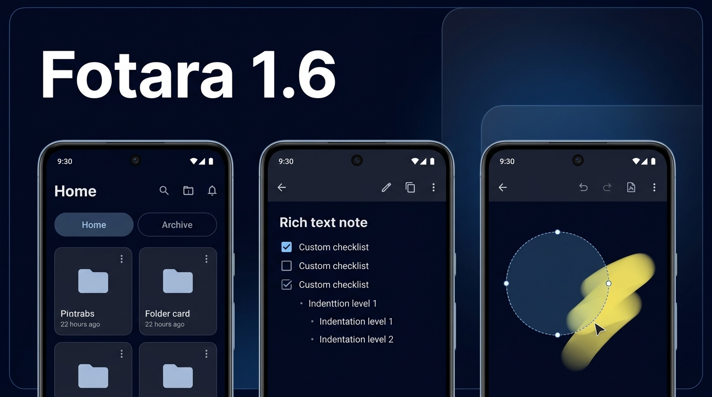

# Fotara 1.6 - Workspace Foundation, Text Note Repairs & Release 1.6.0
Released: 2026-10-04   Status: Released

## Breaking Changes
- Favorit and Arsip tabs were replaced by workspaces. Existing folders were moved to Home.

## What's New
- **Workspaces Foundation**: Organize study and project folders into dedicated workspaces. Switch seamlessly across tabs on the Home screen with custom names, custom order, and dedicated empty states.
- **Add & Rename Workspaces**: Easily create up to 10 custom workspaces with automatic validation via the persistent `(+)` tab or top-right overflow menu. Long-press any custom tab to quickly rename it.
- **Drag & Drop Workspace Reordering**: Press, hold, and drag workspace tabs horizontally with responsive haptic feedback to reorder your workspaces, keeping Home firmly anchored at position 0.
- **Move Folders Across Workspaces**: Move single folders via the folder card menu or bulk move multiple folders in select mode with the new "Move to workspace" action dialog.
- **Delete Workspace with Custom Content Controls**: Delete custom workspaces with full control over their contents: move folders to Home safely, move all folders to Trash with 30-day recovery, or permanently erase everything with multi-step confirmation and live progress feedback.
- **Workspace Destination Choice on Trash Restore**: Restoring a folder from Trash or reviving an orphan note's parent folder now prompts you to choose the destination workspace with a clear radio selector.
- **Workspace-Grouped Folder Pickers**: Folder selection dialogs across Folder Detail, Notes, Canvas Notes, Share Placement, and Trash now organize folders with muted workspace headers when folders span multiple workspaces.
- **Workspace Search Filter Scope**: Search now features an always-visible workspace scope bar with "All" and all your workspaces, allowing you to instantly filter search queries across all note types by workspace.
- **Real Drawn Interactive Checkboxes**: Checklist items now render a true custom drawn rounded checkbox with an Accent Gold outline for unchecked items and a crisp filled checkmark for checked items across all lines in edit mode and preview mode. Tapping the box toggles its state with one undo step while keeping keyboard focus.
- **Visual List Indentation (0 to 3 Levels)**: Nested bullet lists, numbered lists, and checklists now display a clear ~24dp indentation per level, supporting up to 3 indentation levels with dedicated, reactive toolbar buttons.
- **Atomic Block Deletion**: App-drawn markers (bullets, numbers, quotes, and checkboxes) and horizontal dividers can be deleted as clean atomic units. Dividers can be tapped to select for single-key deletion or removed via Backspace from the line below.
- **Canvas Selection & Free Eraser**: Freeform lasso selection tool with interactive move, rotate, and stretch handles, along with a capsule sweep free eraser.
- **Highlighter Blending**: Natural highlighter stroke blending that preserves vector ink aesthetics without darkening overlapping lines.
- **Profile Customization & Normalized Borders**: Avatar decorative borders are normalized to a fixed-diameter circular profile picture with a 1.5% anti-aliased overlap seam, eliminating picture size jumping and anchoring the edit pen button to an invariant 45-degree position.
- **Searchable PDF Content**: Automatic background OCR indexes text page-by-page off the main thread, making PDF documents immediately searchable without altering cards or viewer presentation.
- **Built-in Offline Update Banner**: Sleek theme-styled gradient banner in the update dialog and update center displaying large ElmsSans bold version numbers, tappable repository release links, and distinct "Stable" / "Beta" channel pills.
- **Unified Screen Header**: Standardized screen headers across Home, Notes, and Settings with identical typography (38sp Medium Elms Sans), uniform padding, reserved tagline height (20dp), and standardized circular action buttons ensuring pixel-perfect layout alignment across all primary destinations.
- **On-Demand Notes Filter Chips**: Notes screen now conceals filter chips (All, Photos, Documents, Text, Canvas) by default for a clean, distraction-free view. Tapping the header search button smoothly reveals or collapses chips with an active blue tint, automatically resetting filters to All upon closing.
- **Synchronized Workspace Tabs on Notes**: Added the interactive `WorkspaceTabBar` directly beneath the header on the Notes screen at the exact same vertical baseline as Home. Switching workspaces on Notes filters note items dynamically and synchronizes your selected workspace across the entire app.
- **Workspace-Aware Notes Empty States**: When a workspace contains no notes, the Notes screen presents a clear, contextual message indicating "No notes in [Workspace Name] yet".

## Changed
- **Comprehensive Folder Item Counts**: Folder cards, search results, and delete stats now calculate the total sum of all notes—including Photos, Text Notes, Drawing Canvas Notes, and PDF/Word Documents—ensuring accurate object counts across all media types.
- **LinkIt Glow Tab Isolation**: Spatial corner glow for linked folders is now isolated to the active workspace tab, ensuring glow anchors appear only when linked partner folders are visible on screen.
- **Navigation & Menu Cleanup**: Removed redundant top-left back button on the root Settings screen while preserving seamless system back navigation to the Home tab and back navigation within sub-settings. Cleaned up redundant "Settings" entries from both Home and Notes three-dot overflow menus without dangling dividers.
- **Folder Card Action Button Ergonomics**: Relocated the three-dot overflow button on folder cards to the top-right corner with a 22dp visual center, 44dp touch target, and clean padding, sitting well inside the 24dp rounded corner arc with zero collision with folder accent tiles or titles.

## Fixed
- **Enter Key Handling on Soft Keyboards**: Resolved issue where pressing Enter after applying a list or block tool removed a character backward due to IME composing mismatches; Enter now reliably continues items or splits text as intended.
- **Toolbar Reachability on 360dp Displays**: Added generous end-padding and optimized touch targets so all 17 toolbar actions, including Undo, Redo, Find & Replace, and Schedule, are completely accessible without edge-swipe interference.
- **Indent & Outdent Button Availability**: The indent and outdent tools are now dynamically enabled only when touching list items and strictly bounded between levels 0 and 3.
- **One-Shot Notification Replay**: Hardened one-shot notification consumption to prevent repeating snackbar replays upon returning to Settings.
