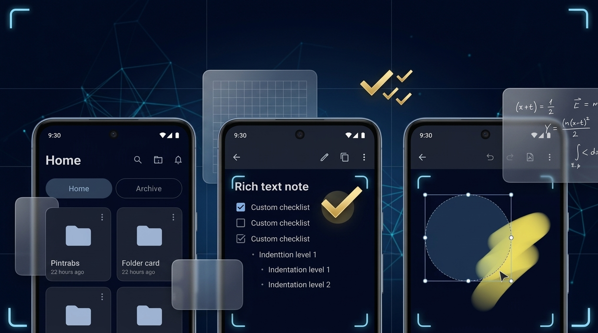

# Fotara 1.7 - Quality improvements and bugfix
Released: 2026-10-05   Status: Released

## What's New
- **Draw on Photo Notes**: Full-featured vector drawing on photo notes. Annotate photos with freehand pen, natural highlighter with blend modes (Multiply, Darken, Screen), and an eraser tool with capsule hit testing. Includes a 100-step undo/redo stack, 600ms debounced autosave, zero-recomposition hardware zoom/pan parity, and non-destructive vector overlays.
- **Export & Share Flattening**: Photo notes with visible vector drawings automatically flatten into high-quality JPEG images (quality 92, downsampled safely if exceeding 4096px) for direct sharing, PDF exports, and combined document generation.
- **PDF Viewer Split Button Color Alignment**: Aligned the "Split to Images" action button tint with `TabCream` (`#EAE3D2`) to match the Share button and top-bar styling across the PDF viewer.
- **Clean Channel Parsing**: Integrated pure `VersionInfo` parser eliminating duplicate "Beta" labels in update modals and settings cards while unifying channel pill presentation.
- **Settings Pinned Title & Progressive Fade**: Pinned Settings header with an ultra-smooth, zero-recomposition progressive vertical gradient fade driven by scroll state.
- **Animated GIF Profile Banners**: Support for animated GIF profile banners (Android 9+ / API 28+) with first-frame preview fallback, 8MB memory safety cap, and lifecycle-aware playback gating.
- **Release Notes Markdown Tables**: Full GitHub Flavored Markdown table syntax parsing with column alignments, alternating row highlights, horizontal scroll containers, and TalkBack accessibility semantics.
- **Zero-Shift Selection Mode**: Entering and exiting selection mode across Home and Folder Detail preserves exact scroll positions, visible item indices, and screen geometry with zero viewport jumping or content shifting.
- **Item-Level Recomposition**: Decoupled selection state from parent layout trees ensures selection toggles recompose exclusively the targeted card and the counter text, completely skipping unchanged grid cards.
- **Stable Thumbnail Caching**: Image and document thumbnails maintain memory-pinned cache requests with crossfade suppression, eliminating visual flashing or blank flickers on item interaction.
- **Overlay Action Dock**: The multi-select action dock in Folder Detail renders as a floating overlay with stable, pre-reserved content breathing room, preventing viewport resizing when items are selected or cleared.

## Area Summary
| Area | Changes | Impact |
|---|---|---|
| Photo Notes | Vector drawing tools & export flattening | Creative note annotation |
| PDF Viewer | Split button color alignment | Visual consistency |
| Versioning | Eliminated duplicate Beta pill | Clean release display |
| Settings | Pinned title & progressive fade | Smooth scroll UX |
| Profile | Animated GIF banner support | Dynamic customization |
| Release Notes | Markdown table parser & semantics | Rich release documentation |
| Selection Mode | Snapshot state & zero-shift overlays | Flicker-free browsing |

## Changed
- **Database Schema v17**: Added `photo_drawings` table with foreign key cascade to `photos(id)` for persistent vector annotations.
- **Orphan Cleanup**: Automated orphan cleanup for photo drawings on app startup and photo permanent deletion.

## Fixed
- **Photo Transform Synchronization**: Synchronized drawing coordinate transformations during 90° photo clockwise rotation and region cropping.
- **Selection Blinking**: Resolved Coil crossfade blinking on thumbnail images when toggling selection mode.

## Patches
### 1.7.1 - 2026-10-05
- **Smoother Zoom and Pan**: Direct GPU matrix transformation on gestures with debounced off-thread tile re-rendering and throttled viewport state publishing.
- **Screen Headers Clipping Fix**: Content-measured header height and line-height descender protection ensuring "Fotara" title and tagline remain unclipped across all system font scales.
- **Workspace Tab Move Mode**: Two-stage long-press interaction enabling panel access on initial lift or full drag reordering when held for an additional 600ms.
- **Remote Release Notes & Banner Images**: Secure HTTPS image loading within update dialogs, What's New screen, and update banners with 16:9 placeholder reservation and dark contrast scrims.

### 1.7.2 - 2026-10-05
- **PDF Search Deep Link & Highlight**: Navigates directly into the target PDF page on search result click, triggering smooth auto-scroll and rendering a 3-second animated amber highlight border and overlay pulse.
- **Workspace Tab Reordering Animation**: Live spring-animated neighboring tab shifting during tab drag reordering, with zero list mutation during gesture loop to eliminate blinking or position resets.
- **Archive Workspace Deletion**: Archive workspace can now be deleted from its options panel, safely transferring contained folders to Home (Home remains the sole immutable workspace).
- **Search Screen Workspace Scope Bar**: Resolved localized names and distinct icons for Home and Archive workspace pills, eliminating blank pills.
- **Notes Screen Action Button Alignment**: Unified the Notes screen (+) FAB to 52dp diameter, 26dp icon, matching Home elevation and spacing while eliminating the black vignette halo artifact.
- **Profile Border Feature Inactivation**: Profile avatar decorative border feature is temporarily disabled, repositioned to the bottom in gray with an "Under construction" notice, and automatically reset to "none" for all existing user profiles.

